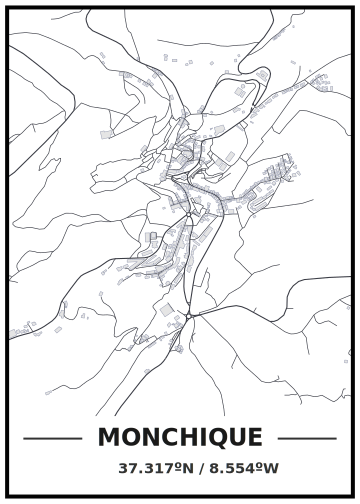

# Streetmaps

Playing with the [streetmaps tutorial](https://ggplot2tutor.com/streetmaps/streetmaps/).

## Monchique, Portugal

## License

Distributed under the MIT License.

## Acknowledgments

- [Christian Burkhart](https://github.com/ch-bu)
- {[ggplot2](https://github.com/tidyverse/ggplot2)}
- {[osmdata](https://github.com/ropensci/osmdata)}
- [Inkscape](https://inkscape.org)
